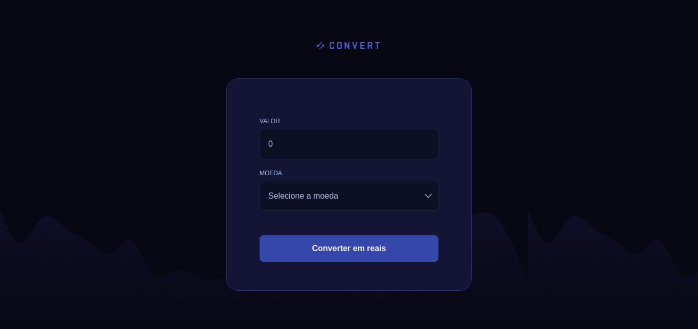

<h1 align="center">💰 Convert 💱</h1>

> Formação Full-Stack: JavaScript: JavaScript Básico.

O projeto é um conversor de moedas que permite a conversão de Dólar Americano (US$), Euro (€) e Libra Esterlina (£) para Real Brasileiro (R$). A ferramenta oferece uma maneira prática e eficiente de realizar as conversões.

[🔗 Clique aqui para acessar](https://fel1324.github.io/Convert/)

## 🤖 Tecnologias

- HTML e CSS
- JavaScript
- Git e Github

## 💚 Contato

rafael.roberto200618@gmail.com

---

Feito com ♥ by Rocketseat :wave: [Participe da nossa comunidade!](https://discord.gg/rocketseat)